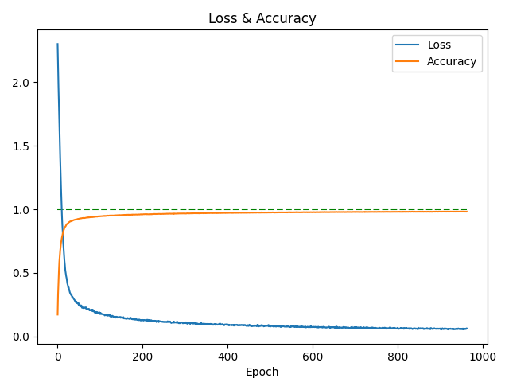
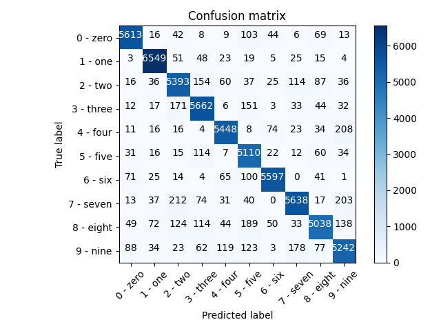
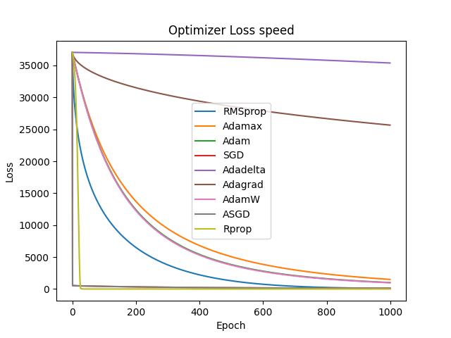

# PyTorch_Learning

PyTorch learning.
 - PyTorch: https://pytorch.org/
 - DOC: https://pytorch.org/docs/stable/index.html
 - Neural Layers: https://pytorch.org/docs/stable/nn.html
 
## Regression Result
|||
|---|---|
|||

## MNIST Classification Result
|||
|---|---|
|||

## Optimization algorithms

## PyTorch Loss Functions 
<!--  -->

The mean squared error loss(MSELoss): 

The Binary Cross Entropy(BCELoss): 

 
The Kullback-Leibler divergence loss(KLDivLoss): 

## Output size calculation
 - Convolutional Layer   
  ,where W=Input image size, F=kernel size, P=padding, S=stride
 - Pooling Layer   
 Same as the Convolutional Layer
 
## Parameter numbers calculation
 - Input layer   
    
 - Fully Connected Layer (FC)   
    
  : weights, : bias iterm.
  c: current layer neurons, p: previous layer neurons. 
 - Convolutional Layer   
   
 m: width of the filter, n: height of the filter, d: input filter numbers, k: ouptut filter numbers.  
 - Pooling Layer   
   